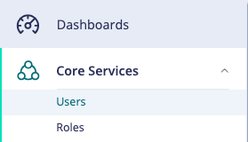
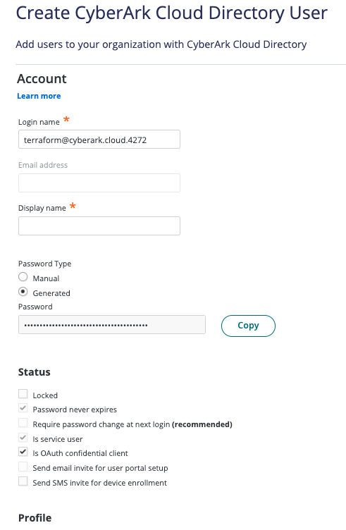
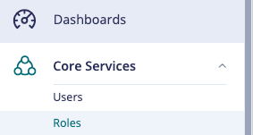
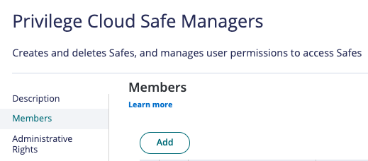
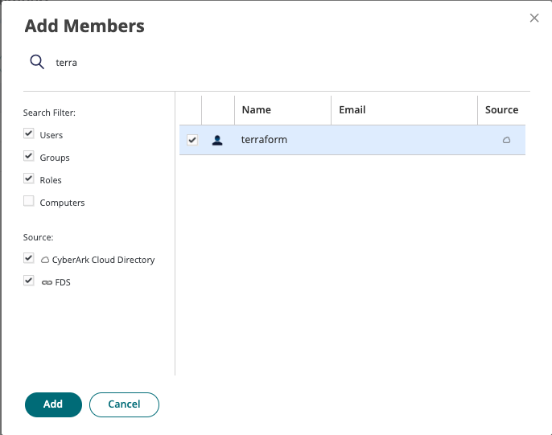

# CyberArk Privilege Cloud Provider
Base provider for managing the state of objects and configurations in Privilege Cloud

## Certification level
{Community}

This repo is a **Community** level project. It's a community contributed project that **is not reviewed or supported
by CyberArk**. For more detailed information on our certification levels, see [our community guidelines](https://github.com/cyberark/community/blob/master/Conjur/conventions/certification-levels.md#community).

## Requirements

# Configurable Environment Variables
*We do not support configuring optional properties via environment variables, these must be implicitly defined.*

## Provider
- CYBERARK_PROVIDER_TENANT
- CYBERARK_PROVIDER_CLIENT_ID
- CYBERARK_PROVIDER_CLIENT_SECRET
- CYBERARK_PROVIDER_DOMAIN
## Accounts
- CYBERARK_ACCOUNT_CUSTOM_NAME
- CYBERARK_ACCOUNT_USERNAME
- CYBERARK_ACCOUNT_PLATFORM
- CYBERARK_ACCOUNT_SAFE
- CYBERARK_ACCOUNT_SECRETTYPE
- CYBERARK_ACCOUNT_SECRET

# Set up Terraform User
- Log into Identity Administration and navigate to the Users Widget

- Create New User

- Populate User Data

- Navigate to the Roles Widget

- Add the new user to the Privilege Cloud Safe Managers Role

- Search for the Terraform User and Add

## Usage instructions

Please see docs at *add provider link when live*

## Contributing

We welcome contributions of all kinds to this repository. For instructions on how to get started and descriptions
of our development workflows, please see our [contributing guide](CONTRIBUTING.md).

## License

Copyright (c) 2020 CyberArk Software Ltd. All rights reserved.

Licensed under the Apache License, Version 2.0 (the "License");
you may not use this file except in compliance with the License.
You may obtain a copy of the License at

   http://www.apache.org/licenses/LICENSE-2.0

Unless required by applicable law or agreed to in writing, software
distributed under the License is distributed on an "AS IS" BASIS,
WITHOUT WARRANTIES OR CONDITIONS OF ANY KIND, either express or implied.
See the License for the specific language governing permissions and
limitations under the License.

For the full license text see [`LICENSE`](LICENSE).
